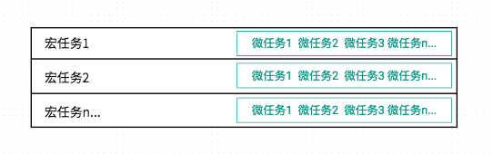
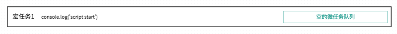
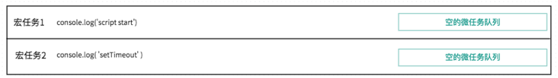
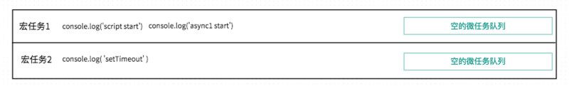
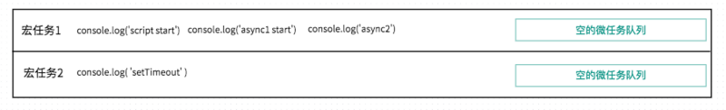
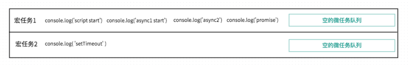
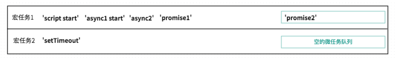
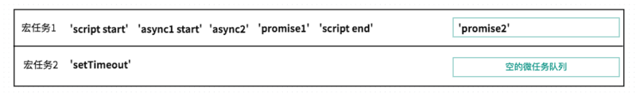
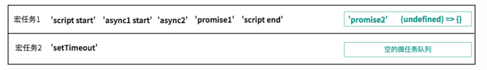
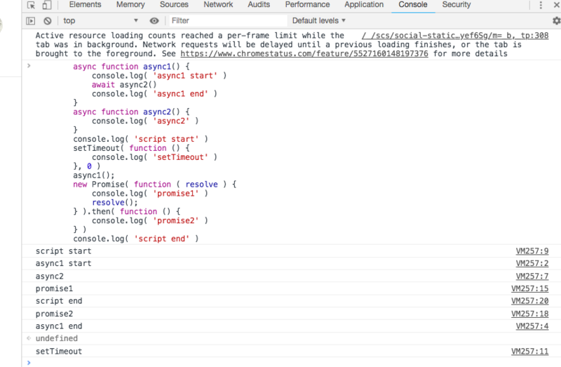

# 1.三个问题

# (1) JS为什么是单线程的?

JS最初被设计用在浏览器中,那么想象一下,如果浏览器中的JS是多线程的。

## 场景描述:

那么现在有2个进程,process1 process2,由于是多进程的JS,所以他们对同一个dom,同时进行操作
process1 删除了该dom,而process2 编辑了该dom,同时下达2个矛盾的命令,浏览器究竟该如何执行呢?

# (2) JS为什么需要异步?

## 场景描述:

如果JS中不存在异步,只能自上而下执行,如果上一行解析时间很长,那么下面的代码就会被阻塞。
对于用户而言,阻塞就意味着"卡死",这样就导致了很差的用户体验。

所以,JS中存在异步执行。

# (3) JS单线程又是如何实现异步的呢?

既然JS是单线程的,只能在一条线程上执行,又是如何实现的异步呢?

## 是通过的事件循环(event loop),理解了event loop机制,就理解了JS的执行机制

<!--more-->

# 2.JS中的event loop(1)

例1,观察它的执行顺序

```
console.log(1)

setTimeout(function(){
    console.log(2)
},0)

console.log(3)
```

运行结果是: 1 3 2

setTimeout里的函数并没有立即执行,而是延迟了一段时间,满足一定条件后,才去执行的,这类代码,我们叫异步代码。

任务分为: 同步任务和异步任务

**按照这种分类方式:JS的执行机制是:**

1. 首先判断JS是同步还是异步,同步就进入主进程,异步就进入异步模块(event table)
2. 异步任务在event table中注册函数,异步执行完毕,被推入任务队列(event queue),并通知主线程
3. 同步任务进入主线程后一直执行,直到主线程空闲时,才会去event queue中查看是否有可执行的异步任务,如果有就推入主进程中

以上三步循环执行,这就是event loop

```
console.log(1) 是同步任务,放入主线程里
setTimeout() 是异步任务,被放入event table, 0秒之后被推入event queue里
console.log(3) 是同步任务,放到主线程里

当 1、3在控制条被打印后,主线程去event queue(事件队列)里查看是否有可执行的函数,执行setTimeout里的函数
```

拓展1:

```
for (var i = 0; i < 10; i++) {
	setTimeout(() => {
	  console.log(i)
	}, 1000)
}
console.log(i)
```

# 3.JS中的event loop(2)

例2:

```
 setTimeout(function(){
     console.log('定时器开始啦')
 });
 
 new Promise(function(resolve){
     console.log('马上执行for循环啦');
     for(var i = 0; i < 10000; i++){
         i == 99 && resolve();
     }
 }).then(function(){
     console.log('执行then函数啦')
 });
 
 console.log('代码执行结束');
```

**准确的划分方式是:**

```
macro-task(宏任务)：包括整体代码script，setTimeout，setInterval (script > DOM(onclick,onscroll...) > ajax > setTimeout > setInterval > setImmediate（NodeJs）> I/O > UI rendering)
micro-task(微任务)：Promise，process.nextTick
```


​    
**按照这种分类方式:JS的执行机制是**

1. 执行一个宏任务,过程中如果遇到微任务,就将其放到微任务的【事件队列】里
2. 当前宏任务执行完成后,会查看微任务的【事件队列】,并将里面全部的微任务依次执行完

尝试按照刚学的执行机制,去分析例2:

```
首先执行script下的宏任务,遇到setTimeout,将其放到【宏任务的队列】里

遇到 new Promise直接执行,打印"马上执行for循环啦"

遇到then方法,是微任务,将其放到【微任务的队列】里

打印 "代码执行结束"

本轮宏任务执行完毕,查看本轮的微任务,发现有一个then方法里的函数, 打印"执行then函数啦"

到此,本轮的event loop 全部完成。
```

​	
​	下一轮的循环里,先执行一个宏任务,发现【宏任务的队列】里有一个 setTimeout里的函数,执行打印"定时器开始啦"

所以最后的执行顺序是【马上执行for循环啦 --- 代码执行结束 --- 执行then函数啦 --- 定时器开始啦】

# 4. 谈谈setTimeout

这段setTimeout代码什么意思? 我们一般说: 3秒后,会执行setTimeout里的那个函数

```
 setTimeout(function(){
    console.log('执行了')
 },3000)    
```

但是这种说并不严谨,准确的解释是: 3秒后,setTimeout里的函数被会推入event queue,而event queue(事件队列)里的任务,只有在主线程空闲时才会执行。

**所以只有满足 (1)3秒后 (2)主线程空闲,同时满足时,才会3秒后执行该函数**

如果主线程执行内容很多,执行时间超过3秒,比如执行了10秒,那么这个函数只能10秒后执行了

**拓展2:**

```
async function async1() {
    console.log("async1 start");
    await async2();
    console.log("async1 end");
}

async function async2() {
    console.log("async2");
}

console.log("script start");

setTimeout(function() {
    console.log("setTimeout");
}, 0);

async1();

new Promise(function(resolve) {
    console.log("promise1");
    resolve();
}).then(function() {
    console.log("promise2");
});

console.log("script end");
```

# 第1部分：对于async await的理解

- async 做一件什么事情？
- await 在等什么？
- await 等到之后，做了一件什么事情？

## async 做一件什么事情？

## 带 async 关键字的函数，它使得你的函数的返回值必定是 promise 对象

- 如果async关键字函数返回的不是promise，会自动用Promise.resolve()包装
- 如果async关键字函数显式地返回promise，那就以返回的promise为准

这是一个简单的例子，可以看到 async 关键字函数和普通函数的返回值的区别

```
async function fn1(){
	return 123
}

function fn2(){
    return 123
}

console.log(fn1())
console.log(fn2())

Promise {<resolved>: 123}
123
```

async 函数,就是把return值包装了一下，其他就跟普通函数一样。

- 在语义上要理解，async表示函数内部有异步操作
- 另外注意，一般 await 关键字要在 async 关键字函数的内部，await 写在外面会报错。

## await 在等什么？

## await 等的是右侧「表达式」的结果

- 右侧如果是函数，那么函数的return值就是「表达式的结果」
- 右侧如果是一个 'hello' 或者什么值，那表达式的结果就是 'hello'

例子-思考打印顺序:

```
async function async1() {
	console.log( 'async1 start' )
	await async2()
	console.log( 'async1 end' )
}
async function async2() {
    console.log( 'async2' )
}
async1()
console.log( 'script start' )
```

## await 等到之后，做了一件什么事情？

那么右侧表达式的结果，就是await要等的东西。

等到之后，对于await来说，分2个情况

- 不是promise对象
- 是promise对象
- **如果不是 promise , await 会暂停async后面的代码，先执行async外面的同步代码，同步代码执行完，再回到async内部，把这个非promise的东西，作为 await表达式的结果**
- **如果它等到的是一个 promise 对象，await 也会暂停async后面的代码，先执行async外面的同步代码，同步代码执行完，当 Promise 对象 fulfilled，然后把 resolve 的参数作为 await 表达式的运算结果。**

# 第2部分：画图一步步看清宏任务、微任务的执行过程

「宏任务」、「微任务」队列



一段代码执行时，会先执行宏任务中的同步代码，

- 如果执行中遇到setTimeout之类宏任务，那么就把这个setTimeout内部的函数推入**「宏任务的队列」**中，下一轮宏任务执行时调用。
- 如果执行中遇到promise.then()之类的微任务，就会推入到**「当前宏任务的微任务队列」**中，在本轮宏任务的同步代码执行都完成后，依次执行所有的微任务1、2、3

**1.直接打印同步代码 console.log('script start')**



**2.将setTimeout放入宏任务队列**



**3.调用async1，打印 同步代码 console.log( 'async1 start' )**



**4.分析一下 await async2()**

前文提过await，1.它先计算出右侧的结果，2.然后看到await后，中断async函数

- **先得到await右侧表达式的结果。执行async2()，打印同步代码console.log('async2'), 并且return Promise.resolve(undefined)**
- **await后，中断async函数，先执行async外的同步代码**

目前就直接打印 console.log('async2')



**5.被阻塞后，要执行async之外的代码**

执行new Promise()，Promise构造函数是直接调用的同步代码，所以 console.log( 'promise1' )



**6.代码运行到promise.then()**

代码运行到promise.then()，发现这个是微任务，所以暂时不打印，只是推入当前宏任务的微任务队列中。

**注意：这里只是把promise2推入微任务队列，并没有执行。微任务会在当前宏任务的同步代码执行完毕，才会依次执行**



**7.打印同步代码 console.log('script end')**

执行完这个同步代码后，「async外的代码」终于走了一遍

下面该回到 await 表达式那里，执行await Promise.resolve(undefined)了



**8.回到async内部，执行await Promise.resolve(undefined)**

**如果一个 Promise 被传递给一个 await 操作符，await 将等待 Promise 正常处理完成并返回其处理结果。**

在我们这个例子中，就是Promise.resolve(undefined)正常处理完成，并返回其处理结果。那么await async2()就算是执行结束了。

目前这个promise的状态是fulfilled，等其处理结果返回就可以执行await下面的代码了。

那何时能拿到处理结果呢？

回忆平时我们用promise，调用resolve后，何时能拿到处理结果？是不是需要在then的第一个参数里，才能拿到结果。

（调用resolve时，会把then的参数推入微任务队列，等主线程空闲时，再调用它）

所以这里的 await Promise.resolve() 就类似于

```
Promise.resolve(undefined).then((undefined) => {

})
```

把then的第一个回调参数 (undefined) => {} 推入微任务队列。

await async2()执行结束，才能继续执行后面的代码

如图



此时当前宏任务1都执行完了，要处理微任务队列里的代码。

微任务队列，先进选出的原则，

- 执行微任务1，打印promise2
- 执行微任务2，没什么内容.

但是微任务2执行后，await async2()语句结束，后面的代码不再被阻塞，所以打印

console.log('async1 end')

**9.宏任务1执行完成后,执行宏任务2**

宏任务2的执行比较简单，就是打印

console.log('setTimeout')

**谷歌浏览器上的测试结果**



```
async function async1() {
    2.console.log("async1 start");
    await async2();
    7.console.log("async1 end");
}

async function async2() {
    3.console.log("async2");
}

1.console.log("script start");

setTimeout(function() {
    8.console.log("setTimeout");
}, 0);

async1();

new Promise(function(resolve) {
    4.console.log("promise1");
    resolve();
}).then(function() {
    6.console.log("promise2");
});

5.console.log("script end");
```