# **一、重排和重绘**

### **介绍浏览器运行机制，重绘和重排对前端性能的影响以及优化的解决方案。**

## **1、重排和重绘的概念和区别**

**重绘（repaint或redaraw）：重绘是指在浏览器渲染机制中，当盒子的位置、大小以及其他属性，例如颜色、字体大小等，浏览器便把这些都按照各自修改后的特性绘制一遍，将内容呈现在页面上。**

**触发重绘的条件：改变元素外观属性或改变盒子物理大小。如：color，background-color等。**

<!--more-->

**重排（重构/回流/reflow）：当渲染树中的一部分(或全部)因为元素的规模尺寸，布局，隐藏等改变而需要重新构建, 这就称为回流(reflow/重排)。每个页面至少需要一次回流，就是在页面第一次加载的时候。**

**重绘和重排的关系：在回流的时候，浏览器会使渲染树中受到影响的部分失效，并重新构造这部分渲染树，完成回流后，浏览器会重新绘制受影响的部分到屏幕中，该过程称为重绘。**

**重排必定会引发重绘，但重绘不一定会引发重排。重排的消耗比重绘的消耗大**

## **2、触发重排的条件：任何页面布局和几何属性的改变都会触发重排，比如：**

（1）页面渲染初始化；(无法避免)**

**（2）添加或删除可见的DOM元素；**

**（3）元素位置的改变，或者使用动画；**

**（4）元素尺寸的改变——大小，外边距，边框；**

**（5）浏览器窗口尺寸的变化（resize事件发生时）；**

**（6）填充内容的改变，比如文本的改变或图片大小改变而引起的计算值宽度和高度的改变；**

**（7）读取某些元素属性导致flush浏览器队列：（offsetLeft/Top/Height/Width,　clientTop/Left/Width/Height,　scrollTop/Left/Width/Height,　width/height,　getComputedStyle(),　currentStyle(IE)　)**

## **3、重绘发生的情况：**

**重绘发生在元素的可见的外观被改变，但并没有影响到布局的时候。比如，仅修改DOM元素的字体颜色（只有Repaint，因为不需要调整布局）**

**重绘重排的代价：耗时，导致浏览器卡慢。**

## **4、几种优化方案：**

## **（1）浏览器自己的优化：**

**浏览器会维护1个队列，把所有会引起回流、重绘的操作放入这个队列，等队列中的操作到了一定的数量或者到了一定的时间间隔，浏览器就会flush队列，进行一个批处理。这样就会让多次的回流、重绘变成一次回流重绘。**

**另一种优化技巧是，在运行几段JavaScript代码时，浏览器会缓存这些改变，在代码运行完毕后再将这些改变一次执行完成。举个例子，下面这段代码只会触发一个reflow和repaint：**

**var $body = $('body');**

**$body.css('padding', '1px'); // reflow, repaint**

**$body.css('color', 'red'); // repaint**

**$body.css('margin', '2px'); // reflow, repaint**

**// only 1 reflow and repaint will actually happen**

**然而，如前所述，改变元素的物理属性会触发强制性的重排。如果我们在上面的代码块中加入一行代码，用来访问元素的属性，就会发生这种现象。**

**var $body = $('body');**

**$body.css('padding', '1px');**

**$body.css('padding')****; // reading a property, a forced reflow**

**$body.css('color', 'red');**

**$body.css('margin', '2px');**

**其结果就是，重排发生了两次。因此，你应该把访问元素属性的操作都组织在一起，从而优化网页性能。**

## **（2）我们要注意的优化：**

**我们要减少重绘和重排就是要减少对渲染树的操作，则我们可以合并多次的DOM和样式的修改。并减少对style样式的请求：**

**<1>直接改变元素的className**

**<2>display：none；先设置元素为display：none；然后进行页面布局等操作；设置完成后将元素设置为display：block；这样的话就只引发两次重绘和重排；**

**使用display:none，不使用visibility，也不要改变它的z-index。**

**<3>不要经常访问浏览器的flush队列属性；如果一定要访问，可以利用缓存。将访问的值用变量存储起来，接下来使用就不会再引发回流；**

**不要把某些DOM节点的属性值放在一个循环里当成循环的变量，当你向浏览器请求一些 style信息的时候，就会让浏览器flush队列，比如 :**

​    **<1> offsetTop, offsetLeft, offsetWidth, offsetHeight**

​    **<2> scrollTop/Left/Width/Height**

​    **<3> clientTop/Left/Width/Height**

​    **<4> width,height**

**当你请求上面的一些属性的时候，浏览器为了给你最精确的值，需要flush队列，因为队列中可能会有影响到这些值的操作。即使你获取元素的布局和样式信息跟最近发生或改变的布局信息无关，浏览器都会强行刷新渲染队列**

**//例如myElement元素沿对角线移动，每次移动一个像素。到500\*500像素的位置结束。**

**timeout循环体中可以这么做**

**myElement.style.left = 1 + myElement.offsetLeft + 'px';**

**myElement.style.top = 1 + myElement.offsetTop + 'px';**

**if(****myElement.offsetLeft >= 500****){**

**stopAnimation();**

**}**

**//显然这种方法低效，每次移动都要查询偏移量，导致浏览器刷新渲染队列而不利于优化。好的办法是获取一次起始位置的值，然后赋值给一个变量。如下**

**var current = myElement.offsetLeft;**

**current++;**

**myElement.style.left = current + 'px';**

**myElement.style.top = current + 'px';**

**if(myElement.offsetLeft >= 500){**

**stopAnimation();**

**}**

**<4>将需要多次重排的元素，position属性设为absolute或fixed，元素脱离了文档流，它的变化不会影响到其他元素。**

**<5>如果需要创建多个DOM节点，可以使用DocumentFragment(文档碎片)创建完后一次性的加入document；**

**<6>尽量不要使用table布局。**

**<7>能用CSS3实现的就用CSS3实现**

**重排重绘这些步骤都是在cpu中发生的。**

**css3是在GPU中发生的：transform  opacity。**

**在 GPU发生的属性比较高效。所以css3性能比较高。**

**<8>****尽量只给位置绝对或者固定的元素添加动画效果。**

# **二、页面的渲染机制/过程**

## **1、浏览器渲染主要流程**

**不同的浏览器内核不同，所以渲染过程不太一样。**

**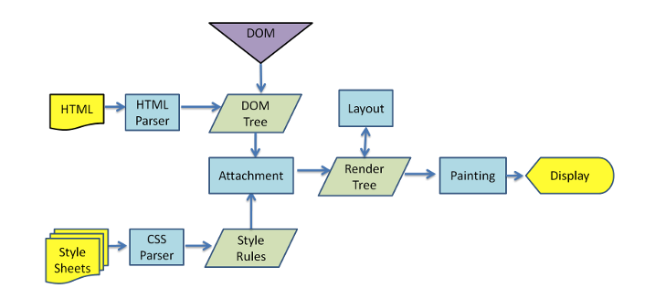**

**WebKit 主流程:**

**HTML -> HTML解析器->DOM Tree->附加->渲染树(根据渲染树布局/重排)->重绘->显示**

**样式表-> CSS解析器->样式规则->链接**

**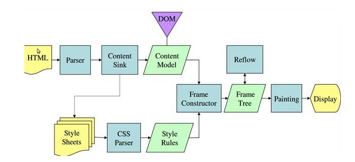**

HTML->解析器->内容渗透->内容模型->框架构造器->框架树->重绘->显示

**Mozilla 的 Gecko 呈现引擎主流程**

**所以可以分析出基本过程：**

1. **HTML解析出DOM Tree**
2. **CSS解析出Style Rules**
3. **将二者关联生成Render Tree**
4. **Layout 根据Render Tree计算每个节点的信息**
5. **Painting 根据计算好的信息绘制整个页面**

# **三、在chrome浏览器中performance中彩色盘：**

### **Chrome调试工具查看页面渲染顺序**

**页面的渲染详细过程可以通过chrome开发者工具中的timeline查看**

**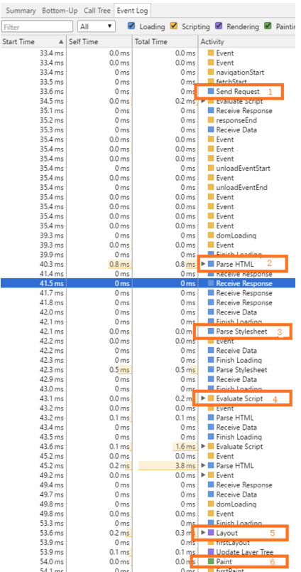**

1. **发起请求；**
2. **解析HTML；**
3. **解析样式；**
4. **执行JavaScript；**
5. **布局；**
6. **绘制**

**蓝色(Loading)：网络通信和HTML解析**

**黄色(Scripting)：JavaScript执行**

**紫色(Rendering)：样式计算和布局，即重排**

**绿色(Painting)：重绘**

**灰色(other)：其它事件花费的时间**

**白色(Idle)：空闲时间**

s

**以途虎微信站为例：**

### **Loading事件**

| **事件**             | **描述**                                                     |
| -------------------- | ------------------------------------------------------------ |
| **Parse HTML**       | **浏览器执行HTML解析**                                       |
| **Finish Loading**   | **网络请求完毕事件**                                         |
| **Receive Data**     | **请求的响应数据到达事件，如果响应数据很大（拆包），可能会多次触发该事件** |
| **Receive Response** | **响应头报文到达时触发**                                     |
| **Send Request**     | **发送网络请求时触发**                                       |

### **Scripting事件**

| **事件**                    | **描述**                                                 |
| --------------------------- | -------------------------------------------------------- |
| **Animation Frame Fired**   | **一个定义好的动画帧发生并开始回调处理时触发**           |
| **Cancel Animation Frame**  | **取消一个动画帧时触发**                                 |
| **GC Event**                | **垃圾回收时触发**                                       |
| **DOMContentLoaded**        | **当页面中的DOM内容加载并解析完毕时触发**                |
| **Evaluate Script**         | **A script was evaluated.**                              |
| **Event**                   | **js事件**                                               |
| **Function Call**           | **只有当浏览器进入到js引擎中时触发**                     |
| **Install Timer**           | **创建计时器（调用setTimeout()和setInterval()）时触发**  |
| **Request Animation Frame** | **A requestAnimationFrame() call scheduled a new frame** |
| **Remove Timer**            | **当清除一个计时器时触发**                               |
| **Time**                    | **调用console.time()触发**                               |
| **Time End**                | **调用console.timeEnd()触发**                            |
| **Timer Fired**             | **定时器激活回调后触发**                                 |
| **XHR Ready State Change**  | **当一个异步请求为就绪状态后触发**                       |
| **XHR Load**                | **当一个异步请求完成加载后触发**                         |

### **Rendering事件**

| **事件**              | **描述**                            |
| --------------------- | ----------------------------------- |
| **Invalidate layout** | **当DOM更改导致页面布局失效时触发** |
| **Layout**            | 页面布局计算执行时触发              |
| Recalculate style     | Chrome重新计算元素样式时触发        |
| Scroll                | 内嵌的视窗滚动时触发                |

### Painting事件

| **事件**         | **描述**                             |
| ---------------- | ------------------------------------ |
| Composite Layers | Chrome的渲染引擎完成图片层合并时触发 |
| Image Decode     | 一个图片资源完成解码后触发           |
| Image Resize     | 一个图片被修改尺寸后触发             |
| Paint            | 合并后的层被绘制到对应显示区域后触发 |

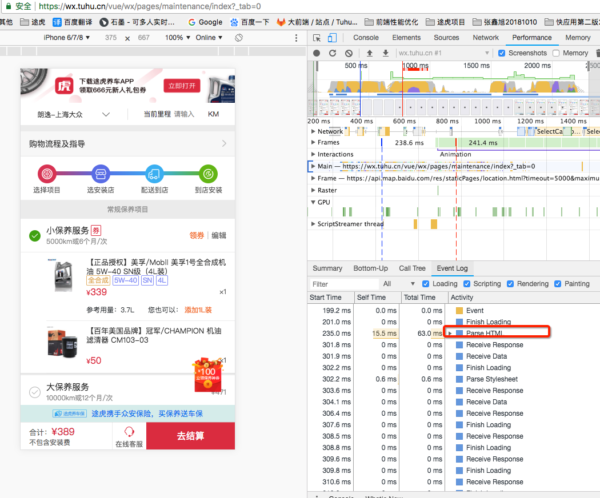

# 四、智能事件处理

## **1、脚本处理**

**浏览器解析文档，当遇到`

`</head>`

`<body>`

`<image src="xxx.png" />`

`</body>`

CSS和图片并没有并行下载，而是等待CSS下载完毕后才去并行下载后面的2个图片，当CSS后面跟着嵌入的JS的时候，该CSS就会出现阻塞后面资源下载的情况。

这样做是为了确保内嵌脚本在执行时能够获得正确的样式信息。所以，最好不要把内嵌脚本放在CSS的<link>之后。

（2）、defer   和   async

async 则是一个乱序执行的主，对它来说脚本的加载和执行是紧紧挨着的，所以不管你声明的顺序如何，只要它加载完了就会立刻执行，async 对于应用脚本的用处不大，因为它完全不考虑依赖（哪怕是最低级的顺序执行），不过它对于那些可以不依赖任何脚本或不被任何脚本依赖的脚本来说却是非常合适的，最典型的例子：Google Analytics。

HTML5规范要求脚本按照它们出现的先后顺序执行，因此第一个延迟脚本会先于第二个延迟脚本执行，而这两个脚本会先于DOMContentLoaded事件。

## 2、脚本位置

（1）很多人喜欢把外链脚本放在head标签内，因为那样更加美观方便。但是当浏览器解析到外链脚本时，会停下来下载脚本执行脚本再继续向后解析，也就是说会导致页面阻塞，在脚本执行完毕之前页面将是一片空白。

（2）另外，脚本的下载和执行也不是并行的，如引入了1.js和2.js，那么整个过程将会是：下载1.js -> 执行1.js -> 下载2.js -> 执行2.js，显然效率很差。虽然IE8、Firefox2.5、Safari4和Chrome2开始允许脚本的并行下载，但是遗憾的是后续资源（样式、图片）的加载仍然需要等待脚本的下载和执行完毕。

（3）结论：脚本推荐放在末尾，让页面先显示出来，让页面加载看起来没有那么慢。

## 3、组织脚本

（1）因为页面每次遇到

// HTML5定义了一个新的拓展属性：async

// 它的作用和defer一样，能够异步地加载和执行脚本

// 缺点：async下，只要脚本下载好就执行，不是按照原本的顺序来执行的

### （2）动态脚本元素，这个最常用也是最有效的

// 通过JS创建script标签，这样里面脚本的加载和执行就会变成异步的 

// 问题：脚本下载完后就马上执行，可能会依赖顺序问题，如B用到了A中函数，但是B先下载完了

var script = document.createElement("script");

script.type = "text/javascript";

script.src = "script1.js";

document.getElementByTagName("head")[0].appendChild(script);

// 解决这个依赖问题- Firefox、Opera, Chorme 和 Safari 3+

// script有一个onload事件，表示加载完毕

script.onload = function(){

​    alert("Script loaded!");

}

// IE总是喜欢特例独行，你懂得，每个script标签都有一个状态，通过检测状态来判断执行情况 

script.onreadystatechange = function(){

​    //因为loaded和complete都有几率出现，并不是唯一的

​    if(script.readyState == "loaded" || script.readyState == "complete"){

​        script.onreadystatechange = null //避免事件重复处理

​        alert("Script loaded.");

​    }

}

// 我们来把它封装一下，让他变得通用，而不再受限浏览器 

function loadScript(url,callback){

​    var script = document.createElement("script")

​    script.type = "text/javascript";

​    if(script.readyState){ // IE

​        script.onreadystatechange = function(){

​            if(script.readyState == "loaded" || script.readyState == "complete"){

​                script.onreadystatechange = null;

​                callback();

​            }

​        };

​    }

​    else { // Others

​        script.onload = function(){

​            callback();

​        }

​    }

​    script.src = url;

​    document.getElementByTagName("head")[0].appendChild(script);

}

//使用它

loadScript("script1.js",function(){

   alert("File is loaded"); 

});

//保证依赖顺序

loadScript("script1.js",function(){

​    loadScript("script2.js",function(){

​        loadScript("script3.js",function(){

​            alert("All files are loaded!");

​        });

​    });

});

## 5、事件委托与冒泡

事件委托，首先按字面的意思就能看的出来，是将事件交由别人来执行，再联想到上面讲的事件冒泡，是不是想到了？对，就是将子元素的事件通过冒泡的形式交由父元素来执行。

因为事件句柄会消耗大量性能，所以需要尽量少地触发事件，如一个DIV中有十个按钮需要事件句柄，那么我们可以将事件句柄放到DIV上，在事件冒泡过程中捕获该事件后再判断事件来源，这可能会增加事件句柄的复杂性，但是一定会提升总体性能。

如果有大量的元素需要绑定时间，尝试使用事件委托。分三步：

- 判断事件来源
- 根据不同来源，进行不同操作
- 取消冒泡，阻止默认行为(可选)

document.querySelector('#nav').onclick=function (e) {

​            if (e.target.nodeName=='A'){

​                foo();

​            }else{

​                foo2()

​            }

}

### 5.1 事件冒泡：

通俗易懂的来讲，就是当一个子元素的事件被触发的时候（如onclick事件），该事件会从事件源（被点击的子元素）开始逐级向上传播，触发父级元素的点击事件。

### （1）要是不给子元素添加具体的oncilck处理方法，也能冒泡么？

发现子元素在没有定义具体的click处理函数的时候仍然可以冒泡，触发父级元素的click事件。

### （2）子元素触发的事件冒泡会触发父元素所有的事件么？还是触发对应的事件？

我们发现只有相应的事件会发生事件冒泡，不相关的事件不受影响（注意由于click为鼠标的点击，所以同样会触发mousedown与mouseup等相关事件，同时发生冒泡！）

### （3）**我们应该如何组织这讨厌的事件冒泡机制呢？**

很简单，在事件触发时，会传入一个相应的event对象，其中有一个stopPropagation()方法可以阻止事件冒泡（IE中为cancleBubble=true），return false

### 5.2 示例：

下面经过详细的例子来说明事件委托：

有可能在开发的时候会遇到这种情况：如导航每一个栏目都要加一个事件，你可能会通过遍历来给每个栏目添加事件：

<ul id="parentUl">

​        <li>我还是个孩子</li>

​        <li>我还是个孩子</li>

​        <li>我还是个孩子</li>

​        <li>我还是个孩子</li>

​        <li>我还是个孩子</li>

​    </ul>

 var ul = document.getElementById('parentUl'),

​            li = ul.getElementsByTagName('li');

​    for (var i = 0; i<li.length;i++){

​        li[i].onclick=function () {

​            alert(this.innerHTML);

​        }

​    }

这种方式来添加事件固然简单，但是需要多次操作DOM不断的与dom节点进行交互，访问dom的次数越多，引起浏览器重绘与重排的次数也就越多，就会延长整个页面的交互就绪时间，如果有100、1000个同级的元素需要添加事件，这种方式简直不忍直视，

而且当我们动态添加新的Li元素的时候，新添加的Li元素是没有被绑定事件的。。。但是下面可以解决这个问题：

var ul = document.getElementById('parentUl'),

​            li = ul.getElementsByTagName('li');

​    function addClick() {

​        for (var i = 0; i<li.length;i++){

​            li[i].onclick=function () {

​                alert(this.innerHTML);

​            }

​        }

​    }

​    addClick();

​    function addElement() {

​        var li = document.createElement('li');

​        li.innerHTML="我是新孩子";

​        ul.appendChild(li);

​        addClick();

​    }

​    addElement();

这样问题不就解决了么！根本不需要什么事件委托！

这样确实解决了问题但是又增加了操作DOM的次数，大大降低了性能，让我们来看一下通过事件委托是怎样降低DOM操作次数：

var ul = document.getElementById('parentUl');

​    ul.onclick=function (event) {

​      var e = event||window.event,

​              source = e.target || e.srcElement;//target表示在事件冒泡中触发事件的源元素，在IE中是srcElement

​        if(source.nodeName.toLowerCase() == "li"){   //判断只有li触发的才会输出内容

​            alert(source.innerHTML);

​        }

​        stopPropagation(e);                           //阻止继续冒泡

​    };

​    function addElement() {

​        var li = document.createElement('li');

​        li.innerHTML="我是新孩子";

​        ul.appendChild(li);

​    }

​       可以通过运行结果看见，新添加的子元素也可以成功通过事件委托显示内容，红色的为li中包含的span，由于代码中将源元素进行了过滤所以不会输出内容。事件委托不仅实现相同了功能，而且大大减少了DOM操作。有朋友可能会问，那我想要给每个li进行不同的处理呢？当然这个可以解决，我们可以通过ev.target获得源元素，就可以获取到data-id等属性或者自定义属性，并通过判断来进行不同的操作。

现在给一个场景 ul > li > div > p，div占满li，p占满div，还是给ul绑定时间，需要判断点击的是不是li（假设li里面的结构是不固定的），那么e.target就可能是p，也有可能是div，这种情况你会怎么处理呢？

<ul id="test">

​        <li>

            
11111111111

​        </li>

​        <li>

            

​            

​        </li>

​        <li>

​            3333333333

​        </li>

​        <li>4444444</li>

​    </ul>

如上列表，有4个li，里面的内容各不相同，点击li，event对象肯定是当前点击的对象，怎么指定到li上，下面我直接给解决方案：

var oUl = document.getElementById('test');

​    oUl.addEventListener('click',function(ev){

​        var target = ev.target;

​        while(target !== oUl ){

​            if(target.tagName.toLowerCase() == 'li'){

​                console.log('li click~');

​                break;

​            }

​            target = target.parentNode;

​        }

​    })

 核心代码是while循环部分，实际上就是一个递归调用，你也可以写成一个函数，用递归的方法来调用，同时用到冒泡的原理，从里往外冒泡，知道currentTarget为止，当当前的target是li的时候，就可以执行对应的事件了，然后终止循环

## 6、requestAnimationFrame优化更新页面

（1）requestAnimationFrame与setTimeout和setInterval类似，都是通过递归调用同一个方法不断更新页面。

- setTimeout()：在特定的时间后执行函数，而且只执行一次，如果在特定时间前想取消执行函数，可以用clearTimeout立即取消执行。但是并不是每次执行setTimeout都会在特定的时间后执行，页面加载后js会按照主线程中的顺序按序执行那个，如果在延迟时间内主线程不空闲，setTimeout里面的函数是不会执行的，它会延迟到主线程空闲时才执行，以上两种情况都会导致setTimeout的执行步调和屏幕的刷新步调不一致，从而引起**丢帧**现象。
- setInterval()：在特定的时间间隔内重复执行函数，除非主动清除它，不然会一直执行下去，清除函数可以使用clearInterval。setInterval也会等到主线程空闲了再执行，但是setInterval去排队时，如果发现自己还在队列中未执行，就会被drop掉，所以可能会造成某段时间的函数未被执行。
- requestAnimationFrame()：它不需要设置时间间隔，它会在浏览器每次刷新之前执行回调函数的任务。这样我们动画的更新就能和浏览器的刷新频率，根据屏幕刷新频率的高处就是使动画看起来更流畅不卡顿。requestAnimationFrame在运行时，浏览器会自动优化方法的调用，并且如果页面不是激活状态下的话，动画会自动暂停，有效节省了CPU开销。

示例：

var progress = 0;

//回调函数

function render() {

​    progress += 1; //修改图像的位置

 

​    if (progress < 100) {

​           //在动画没有结束前，递归渲染

​           window.requestAnimationFrame(render);

​    }

}

 

//第一帧渲染

window.requestAnimationFrame(render);

除此之外，requestAnimationFrame还有以下两个优势：

- **CPU节能**：使用setTimeout实现的动画，当页面被隐藏或最小化时，setTimeout 仍然在后台执行动画任务，由于此时页面处于不可见或不可用状态，刷新动画是没有意义的，完全是浪费CPU资源。而requestAnimationFrame则完全不同，当页面处理未激活的状态下，该页面的屏幕刷新任务也会被系统暂停，因此跟着系统步伐走的requestAnimationFrame也会停止渲染，当页面被激活时，动画就从上次停留的地方继续执行，有效节省了CPU开销。
- **函数节流**：在高频率事件(resize,scroll等)中，为了防止在一个刷新间隔内发生多次函数执行，使用requestAnimationFrame可保证每个刷新间隔内，函数只被执行一次，这样既能保证流畅性，也能更好的节省函数执行的开销。一个刷新间隔内函数执行多次时没有意义的，因为显示器每16.7ms刷新一次，多次绘制并不会在屏幕上体现出来。

（2）优雅降级

由于requestAnimationFrame目前还存在兼容性问题，而且不同的浏览器还需要带不同的前缀。因此需要通过优雅降级的方式对requestAnimationFrame进行封装，优先使用高级特性，然后再根据不同浏览器的情况进行回退，直止只能使用setTimeout的情况。

| 345678910111213141516171819202122232425 | **if** (!Date.now)    Date.now = **function**() { **return** **new** Date().getTime(); }; (**function**() {    'use strict';         **var** vendors = ['webkit', 'moz'];    **for** (**var** i = 0; i < vendors.length && !window.requestAnimationFrame; ++i) {        **var** vp = vendors[i];        window.requestAnimationFrame = window[vp+'RequestAnimationFrame'];        window.cancelAnimationFrame = (window[vp+'CancelAnimationFrame']                                   \|\| window[vp+'CancelRequestAnimationFrame']);    }    **if** (/iP(ad\|hone\|od).*OS 6/.test(window.navigator.userAgent) *// iOS6 is buggy*        \|\| !window.requestAnimationFrame \|\| !window.cancelAnimationFrame) {        **var** lastTime = 0;        window.requestAnimationFrame = **function**(callback) {            **var** now = Date.now();            **var** nextTime = Math.max(lastTime + 16, now);            **return** setTimeout(**function**() { callback(lastTime = nextTime); },                              nextTime - now);        };        window.cancelAnimationFrame = clearTimeout;    }}()); |
| --------------------------------------- | ------------------------------------------------------------ |
|                                         |                                                              |

## 7、吸顶导航条相关及scroll滚动优化

### 1、存在的问题

吸顶导航条要求当页面滚动到某个区域时，对应该区域的导航条在设置的显示范围内保持吸顶显示。涉及到的操作：

- 监听页面的scroll事件
- 在页面滚动时进行计算和DOM操作
- 计算：计算当前所在位置是否为对应导航条的显示范围
- DOM操作：显示在范围内的导航条并且隐藏其他导航条

由于scroll事件被触发的频率高、间隔近，如果此时进行DOM操作或计算并且这些DOM操作和计算无法在下一次scroll事件发生前完成，就会造成掉帧、页面卡顿，影响用户体验。

### 2、优化方案

针对该项目中的问题，采取的解决方法是：

（1）尽量控制DOM的显示或隐藏，而不是删除或添加：

页面加载时根据当前页面中吸顶导航的数量复制对应的DOM，并且隐藏这些导航。当页面滚动到指定区域后，显示对应的导航。

（2）一次性操作DOM:

将复制的DOM存储到数组中，将该数组append到对应的父节点下，而不是根据复制得到DOM的数量依次循环插入到父节点下。

（3）多做缓存:

如果某个节点将在后续进行多次操作，可以将该节点利用变量存储起来，而不是每次进行操作时都去查找一遍该节点。

（4）使用 requestAnimationFrame优化页面滚动

# 五、svg和canvas的不同场景的使用区别

## 1、各自的特点和区别

1. canvas
2. html5新增的新的标签
3. 通过javascript来绘制2D图像的，且逐像素进行渲染的
4. canvas使用javascript在网页上绘制图像，本身并没有绘制能力
5. 在Canvas中一旦图形被绘制完成，它就不会得到浏览器的关注，一旦其位置发生变化，那么整个场景需要重新绘制，包括任何已被该图形覆盖了的图形
6. canvas 的动画其实是逐帧渲染的，因为每一次绘制其实都是一个静态的，通过不断的 计算和rerender，来实现动效

1. svg
2. SVG 是一种基于 XML 语法的图像格式，全称是可缩放矢量图（Scalable Vector Graphics）
3. SVG 则是属于对图像的形状描述，所以它本质上是文本文件，体积较小，且不管放大多少倍都不会失真
4. 因为是基于XML，那么svg DOM中的每一个元素都可以，绑定上javascript事件处理器
5. SVG并不属于html5专有内容，在html5之前就有SVG
6. svg 其实和我们传统的 dom 动画类似，他支持类似 css 中的 transform 、transition 等等来实现动画，也可以通过 js 获取 svg 节点来改变 style 属性来实现动画，总体来说还是和传统的 dom 实现动画思路较为一致

1. 两者区别
2. canvas依赖分辨率, svg不依赖分辨率
3. canvas不支持事件绑定, svg支持事件处理器
4. canvas弱的文本渲染能力
5. canvas能够以.png和.jpg的格式保存结果图像
6. canvas最适合图像密集的游戏，其中许多对象将会被频繁重绘
7. svg最适合带有大型渲染区域的应用程序（比如谷歌地图）
8. svg复杂度高会减慢渲染速度（任何过度使用DOM的应用都不快）,所以svg不适合做游戏应用

1. 总结

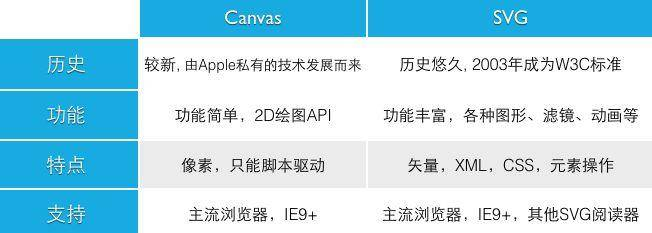



## 2、各自的适用场景

1. canvas适用场景
2. 一些复杂动画或者游戏
3. 小画布、大数据量的场景
4. 一些令人印象深刻的图形效果，例如光线跟踪或滤镜
5. 实时数据的更新

1. svg适用场景
2. 体积小  => 适用于移动端
3. 节点多 => 适用于静态图标或者复杂度不高的图表
4. 不依赖分辨率 => 适用于高保真文档查看和打印的应用场景
5. 画布非常大，有缩放、平移等高频的交互，或者移动端对内存占用量非常敏感等场景

1. 适用场景总结

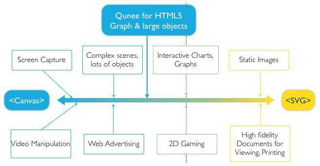

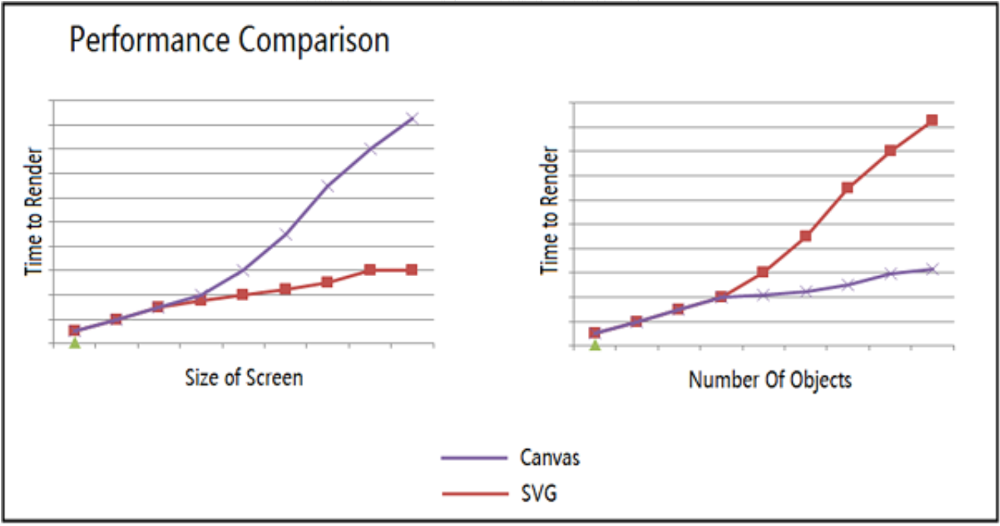

# 六、DocumentFragment 文档碎片

## 1、介绍和基本使用

1. 介绍
2. documentFragment表示一个没有父级文件的最小文档对象，可以被当作一个轻量级的document对象
3. 它不是一个真是的DOM树的一部分，它的变化不会引起DOM树的重新渲染的操作
4. 在jquery中和vue中都使用了它来进行DOM操作优化

1. 基本使用

// 创建

let oFrag = document.createDocumentFragment()

// 使用

for(let i=0;i<100;i++) { 

  let op=document.createElement("P")

  let oText=document.createTextNode(i)

  op.appendChild(oText)

  oFrag.appendChild(op)

} 

document.body.appendChild(oFrag)

## 2、用来优化界面性能

1. 基本优化

// 在body中添加100个p元素

// 基本写法

for(var i=0;i<100;i++) {

 var op=document.createElement("p");

 var oText=document.createTextNode(i);

 op.appendChild(oText); 

 document.body.appendChild(op);

}

// 常规优化写法

var lis = "",

​    ul = document.createElement("ul"); 

for(var i = 1; i <= 100; i++) {

 lis += "<li>第" + i + "行</li>";

}

ul.innerHTML = lis; 

document.body.appendChild(ul);

// documentFragment写法

let oFrag = document.createDocumentFragment()

for(let i=0;i<100;i++) { 

  let op=document.createElement("P")

  let oText=document.createTextNode(i)

  op.appendChild(oText)

  oFrag.appendChild(op)

} 

document.body.appendChild(oFrag)

// 在上述三种写法中    

//    第一种性能最差，毋庸置疑

//    第二种只进行了一次dom操作，和一次页面重绘，是一个好办法，但是对后续拓展和维护不友好，也无法封装成一个方法

//    第三种方法操作了两次dom，和一次重绘，主要的是文档碎片插入完自动会被销毁碎片内容，页面上没有多出新的节点

1. 细节

var oFrag=document.createDocumentFragment();

for(var i=0;i<100;i++) { 

  var op=document.createElement("P"); 

  var oText=document.createTextNode(i); 

  op.appendChild(oText); 

  oFrag.appendChild(op); 

} 

document.body.appendChild(oFrag); 

for(var i=0;i<100;i++) { 

  var op=document.createElement("P"); 

  var oText=document.createTextNode(i);                 

  op.appendChild(oText); 

  oFrag.appendChild(op); 

} 

document.body.appendChild(oFrag);

// 你运行代码你会发现0-99,0-99

// 说明了只要文档碎片一但被插入后，会进行一个碎片回收，清除，但是文档碎片容器还是存在的，我们不用再次重新再进行一次dom操作来进行创建文档碎片

1. 性能报告
2. jquery作者John Resig给了性能测试报告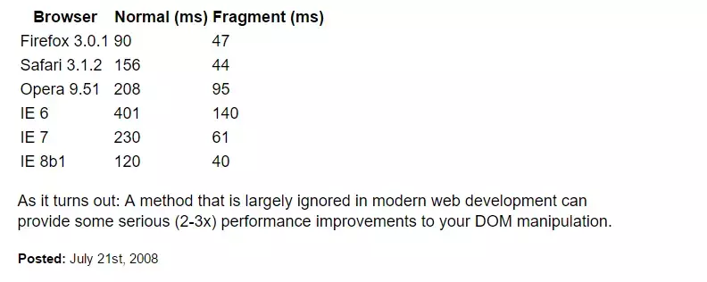

###  

1. 在框架中的应用
2. 在jquery中
3. 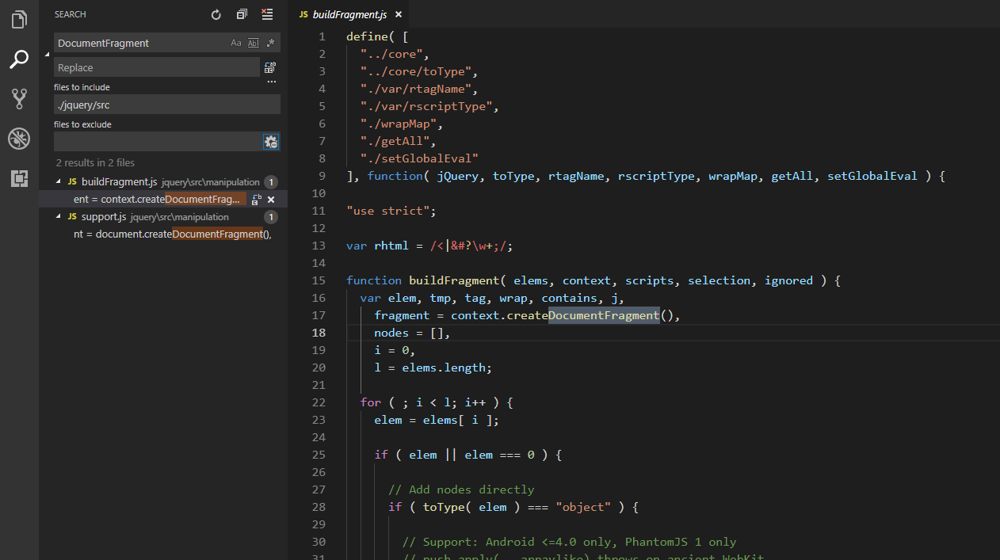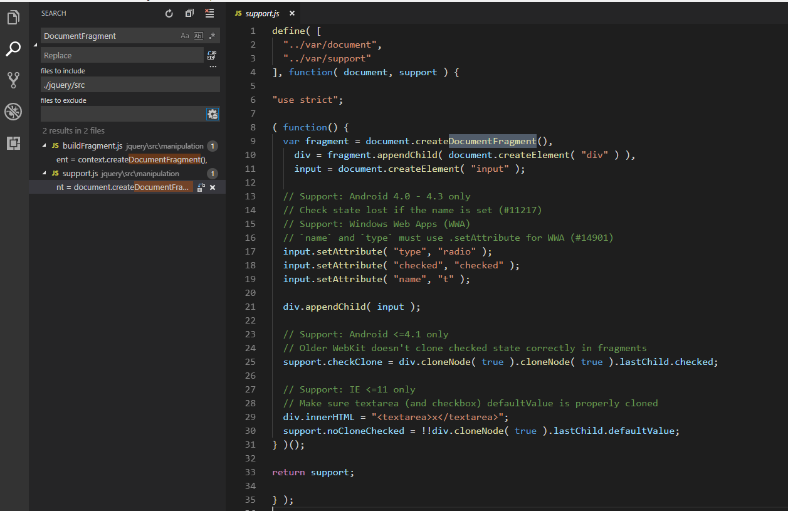
4. 在jq中有两个方法用到了，一个是support.js，用来判断浏览器支持程度的，另一个就是buildFragment.js，是专门用作jq内部进行dom操作的
5. buildFragment 只在 domManip 和 jQuery.parseHTML 中使用
6. domManip 则被 DOM 操作如 append、prepend、before、after 等方法的所依赖
7. jQuery.parseHTML 则被init和load方法所依赖
8. 可以看出，几乎所有的DOM操作都使用了documentFragment来优化
9. 在vue 1 中
10. 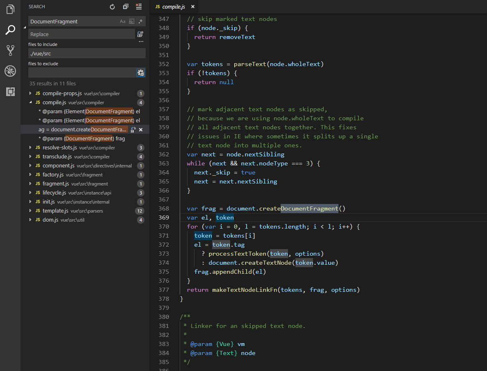
11. 可以看到有很多方法都用到了documentFragment
12. 主要介绍个compile.js，它的主要功能是编译相关，也就是最后将虚拟DOM转化成真实DOM的过程，所以这里会对页面进行DOM操作；在这里也是使用了documentFragment进行了优化操作
13. 为什么Vue 2.x 中没有用documentFragment，因为Vue 2.x中使用了虚拟DOM

1. **附：在chrome中查看页面的更新情况**

- 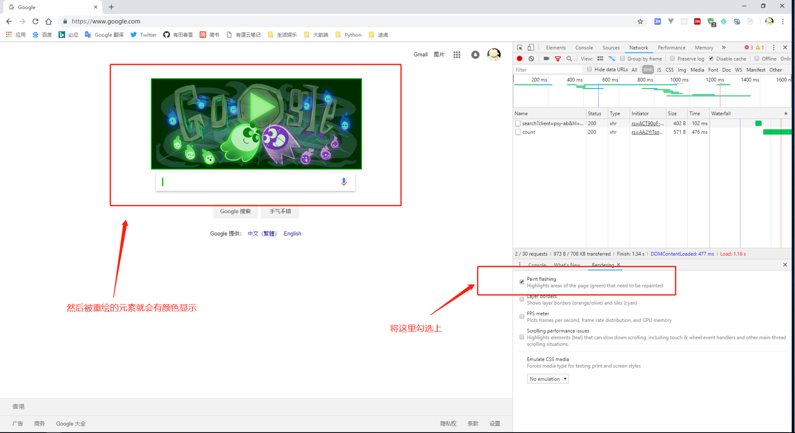

# 七、js函数中的防抖和节流

## 1、前言

防抖（Debounce）和节流 （Throttle） 都是用来控制某个函数在一定时间内执行次数的多少以优化高频率执行js代码的一种技巧，两者相似而又不同。

## 2、概念

​	    函数防抖（debounce）是指在一定时间内，在动作被连续频繁触发的情况下，动作只会被执行一次，也就是说当调用动作过n毫秒后，才会执行该动作，若在这n毫秒内又调用此动作则将重新计算执行时间，所以短时间内的连续动作永远只会触发一次，比如说用手指一直按住一个弹簧，它将不会弹起直到你松手为止。

​	   函数节流是指一定时间内执行的操作只执行一次，也就是说即预先设定一个执行周期，当调用动作的时刻大于等于执行周期则执行该动作，然后进入下一个新周期，一个比较形象的例子是如果将水龙头拧紧直到水是以水滴的形式流出，那你会发现每隔一段时间，就会有一滴水流出。

​	   函数节流（throttle）与 函数防抖（debounce）都是为了限制函数的执行频次，以优化函数触发频率过高导致的响应速度跟不上触发频率，出现延迟，假死或卡顿的现象。

​	  比如如下的情况：

​	 (1) window对象的resize、scroll事件

​	 (2) 拖拽时的mousemove事件

​	 (3)文字输入、自动完成的keyup事件

## 3、应用场景

​	1、函数防抖

​	     假设我们网站有个搜索框，用户输入文本我们会自动联想匹配出一些结果供用户选择。我们可能首先想到的做法就是监听keyup事件，然后异步去查询结果。这个方法本身是没错的，但是如果用户快速的输入了一连串的字符，假设是10个字符，那么就会在瞬间触发了10次的请求，这无疑不是我们想要的。我们想要的是用户停止输入的时候才去触发查询的请求，这时候防抖函数就可以帮到我们。

   简短示例如下：

function debounce(fn, delay) {

​    let handle;

​    return function (e) {

​        // 取消之前的延时调用

​        clearTimeout(handle);

​        handle = setTimeout(() => {

​            fn(e);

​        }, delay);

​    }

}

使用方式：

1、window.addEventListener('resize', debounce(fun, 500));

// 函数防抖

2、var timer = null;

document.getElementById("debounce").onscroll = function(){

​    clearTimeout(timer); // 清除未执行的代码，重置回初始化状态

​    timer = setTimeout(function(){

​        console.log("函数防抖");

​    }, 300);

};  

​	2、函数节流

​	     如果我们现在需要做一个记录用户鼠标移动轨迹的小应用，像这种对流畅度有一定的要求的情况，再用上面的防抖函数就不合适了，如果用防抖函数会出现什么效果呢？如果鼠标移动速度较快，那么只有在我们每次鼠标停下来的时候才能发送当前的位置，但是如果我们每次移动都发送并记录鼠标的位置，那也是相当恐怖的，鼠标随便移动一下就会有成百上千条记录位置的请求发出去，这个时候我们就可以用到函数节流，节流顾名思义也就是个一段儿时间去发送一次位置，可以大大减少请求发送次数。

简短示例如下：

function throttle(fn, delay) {

​    let runFlag = false;

​    return function (e) {

​        // 判断之前的调用是否完成

​        if (runFlag) {

​            return false;

​        }

​        runFlag = true;

​        setTimeout(() => {

​            fn(e);

​            runFlag = false;

​        }, delay)

   }

 }

更完善的使用参见lodash

# 八、简易的图片滚动懒加载

## 1、滚动加载

当访问一个页面的时候，先把img元素或是其他元素的背景图片路径替换成固定尺寸图片的路径（这样就只需请求一次），只有当图片出现在浏览器的可视区域内时，才设置图片正真的路径，让图片显示出来。这就是图片懒加载。

## 2、使用目的

减少图片过多可能造成的卡顿问题，减少渲染成本。

## 3、实现方式

  1、页面中的img元素，如果没有src属性，浏览器就不会发出请求去下载图片，一旦通过javascript设置了图片路径，浏览器才会送请求。

  2、如何获取正真的路径，这个简单，现在正真的路径存在元素的“data-url”（这个名字起个自己认识好记的就行）属性里，要用的时候就取出来，再设置；

  3、开始比较之前，先了解一些基本的知识，比如说如何获取某个元素的尺寸大小、滚动条滚动距离及偏移位置距离； 

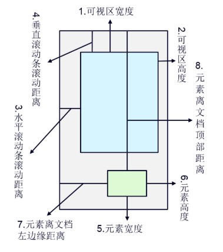

1）屏幕可视窗口大小：对应于图中1、2位置处

原生方法：

window.innerHeight 标准浏览器及IE9+ || document.documentElement.clientHeight 标准浏览器及低版本IE标准模式 ||

document.body.clientHeight 低版本混杂模式

jQuery方法：

 $(window).height() 

  2）浏览器窗口顶部与文档顶部之间的距离，也就是滚动条滚动的距离：也就是图中3、4处对应的位置；

原生方法：

window.pagYoffset——IE9+及标准浏览器 || document.documentElement.scrollTop 兼容ie低版本的标准模式 ||

document.body.scrollTop 兼容混杂模式；

jQuery方法：$(document).scrollTop(); 

  3）获取元素的尺寸：对应于图中5、6位置处；左边jquery方法，右边原生方法

$(o).width() = o.style.width; 

$(o).innerWidth() = o.style.width+o.style.padding;

$(o).outerWidth() = o.offsetWidth = o.style.width+o.style.padding+o.style.border;

$(o).outerWidth(true) = o.style.width+o.style.padding+o.style.border+o.style.margin;

​        注意：要使用原生的style.xxx方法获取属性，这个元素必须已经有内嵌的样式，如

；

​        如果原先是通过外部或内部样式表定义css样式，必须使用o.currentStyle[xxx] || document.defaultView.getComputedStyle(0)[xxx]来获取样式值

  4）获取元素的位置信息：对应与图中7、8位置处

jQuery：

$(o).offset().top元素距离文档顶的距离，

$(o).offset().left元素距离文档左边缘的距离

原生：getoffsetTop()，高程上有具体说明，这边就忽略了；

返回元素相对于第一个以定位的父元素的偏移距离，注意与上面偏移距的区别；

jQuery：position()返回一个对象，$(o).position().left = style.left，$(o).position().top = style.top；

## 4、可视窗口区域

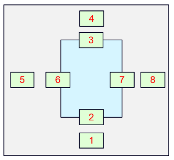

# 九、浅析浏览器网络缓存

## 1、前言

缓存会根据请求保存输出内容的副本，例如 **页面、图片、文件**，当下一个请求来到的时候:如果是相同的URL，缓存直接使 用本地的副本响应访问请求，而不是向源服务器再次发送请求。因此，可以从以下 **2** 个方面提升性能：

- 减少相应延迟，提升响应时间
- 减少网络带宽消耗，节省流量

## 2、缓存机制

我们用两幅图来了解下浏览器的 **缓存机制**

**浏览器第一次请求：**

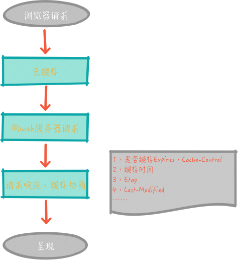

**浏览器再次请求：**

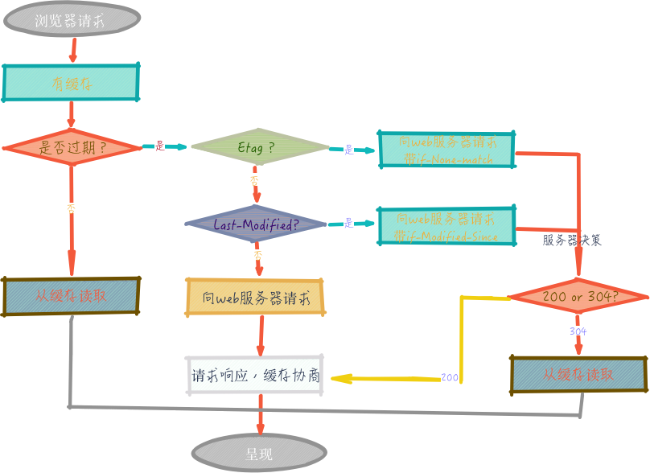

从以上两幅图中，可以清楚的了解浏览器 **缓存** 的过程。 首次访问一个 URL ，没有 **缓存** ，但是，服务器会响应一些 header 信息，如：expires、cache-control、last-modified、etag 等，来记录下次请求是否缓存、如何缓存。 再次访问这个 URL 时候，浏览器会根据首次访问返回的 header 信息，来决策是否缓存、如何缓存。 我们重点来分析下第二幅图，其实是分两条线路，如下 👇

- **第一条线路：** 当浏览器再次访问某个 URL 时，会先获取资源的 header 信息，判断是否命中强缓存 *（cache-control和expires）* ，如命中，直接从缓存获取资源，包括响应的 header 信息 *（请求不会和服务器通信）* ，也就是 **强缓存** ，如图



- **第二条线路：** 如没有命中 **强缓存** ，浏览器会发送请求到服务器，请求会携带第一次请求返回的有关缓存的 header 信息 *（Last-Modified/If-Modified-Since和Etag/If-None-Match）* ，由服务器根据请求中的相关 header 信息来比对结果是否协商缓存命中；若命中，则服务器返回新的响应 header 信息更新缓存中的对应 header 信息，但是并不返回资源内容，它会告知浏览器可以直接从缓存获取；否则返回最新的资源内容，也就是 **协商缓存**。

 

 

现在，我们了解到浏览器缓存机制分为 **强缓存、协商缓存**，再来看看他们的区别 👇

| **缓存策略** | **获取资源形式** | **状态码**               | **发送请求到服务器**             |
| ------------ | ---------------- | ------------------------ | -------------------------------- |
| 强缓存       | 从缓存取         | 200（from memory cache） | 否，直接从缓存取                 |
| 协商缓存     | 从缓存取         | 304（not modified）      | 是，通过服务器来告知缓存是否可用 |

### 强缓存

与强缓存相关的 header 字段有两个：

(1) expires

**expires：** 这是 http1.0 时的规范，它的值为一个绝对时间的 **GMT** 格式的时间字符串，如 Mon, 10 Jun 2015 21:31:12 GMT ，如果发送请求的时间在 **expires** 之前，那么本地缓存始终有效，否则就会发送请求到服务器来获取资源

(2)cache-control

**cache-control:** max-age=number ，这是 http1.1 时出现的 header 信息，主要是利用该字段的 max-age 值来进行判断，它是一个相对值；资源第一次的请求时间和 **Cache-Control** 设定的有效期，计算出一个资源过期时间，再拿这个过期时间跟当前的请求时间比较，如果请求时间在过期时间之前，就能命中缓存，否则未命中， **cache-control** 除了该字段外，还有下面几个比较常用的设置值：

- **no-cache：** 不使用本地缓存。需要使用缓存协商，先与服务器确认返回的响应是否被更改，如果之前的响应中存在 ETag ，那么请求的时候会与服务端验证，如果资源未被更改，则可以避免重新下载。
- **no-store：** 直接禁止游览器缓存数据，每次用户请求该资源，都会向服务器发送一个请求，每次都会下载完整的资源。
- **public：** 可以被所有的用户缓存，包括终端用户和 CDN 等中间代理服务器。
- **private：** 只能被终端用户的浏览器缓存，不允许 CDN 等中继缓存服务器对其缓存。

> *Tips：如果 cache-control 与 expires 同时存在的话，cache-control 的优先级高于 expires*

### 协商缓存

协商缓存都是由浏览器和服务器协商，来确定是否缓存，协商主要通过下面两组 header 字段，这两组字段都是成对出现的，即第一次请求的响应头带上某个字段 *（* **Last-Modified** *或者* **Etag** *）* ，则后续请求会带上对应的请求字段 *（***If-Modified-Since** *或者* **If-None-Match** *）* ，若响应头没有 **Last-Modified** 或者 **Etag** 字段，则请求头也不会有对应的字段。

 

**Last-Modified/If-Modified-Since**

 

二者的值都是 GMT 格式的时间字符串，具体过程：

 

浏览器第一次跟服务器请求一个资源，服务器在返回这个资源的同时，在 respone 的 header 加上 **Last-Modified** 字段，这个 header 字段表示这个资源在服务器上的最后修改时间

浏览器再次跟服务器请求这个资源时，在 request 的 header 上加上 **If-Modified-Since** 字段，这个 header 字段的值就是上一次请求时返回的 **Last-Modified** 的值

服务器再次收到资源请求时，根据浏览器传过来 **If-Modified-Since** 和资源在服务器上的最后修改时间判断资源是否有变化，如果没有变化则返回 304 Not Modified ，但是不会返回资源内容；如果有变化，就正常返回资源内容。当服务器返回 304 Not Modified 的响应时，response header 中不会再添加 **Last-Modified的header** ，因为既然资源没有变化，那么 **Last-Modified** 也就不会改变，这是服务器返回 304 时的 response header

 

浏览器收到 304 的响应后，就会从缓存中加载资源

如果协商缓存没有命中，浏览器直接从服务器加载资源时，**Last-Modified** 的 Header 在重新加载的时候会被更新，下次请求时，**If-Modified-Since** 会启用上次返回的**Last-Modified** 值

**Etag/If-None-Match**

这两个值是由服务器生成的每个资源的唯一标识字符串，只要资源有变化就这个值就会改变；其判断过程与 **Last-Modified、If-Modified-Since** 类似，与 **Last-Modified** 不一样的是，当服务器返回 304 Not Modified 的响应时，由于 **ETag** 重新生成过，response header 中还会把这个 **ETag** 返回，即使这个 **ETag** 跟之前的没有变化。

>

> *Tips：Last-Modified与ETag是可以一起使用的，服务器会优先验证ETag，一致的情况下，才会继续比对Last-Modified，最后才决定是否返回304。*

## 3.比较

1·强缓存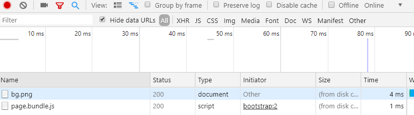

2.协商缓存

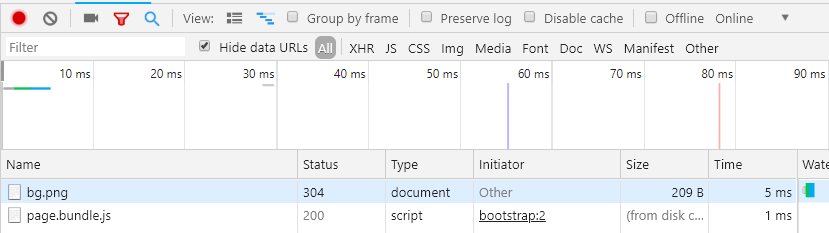