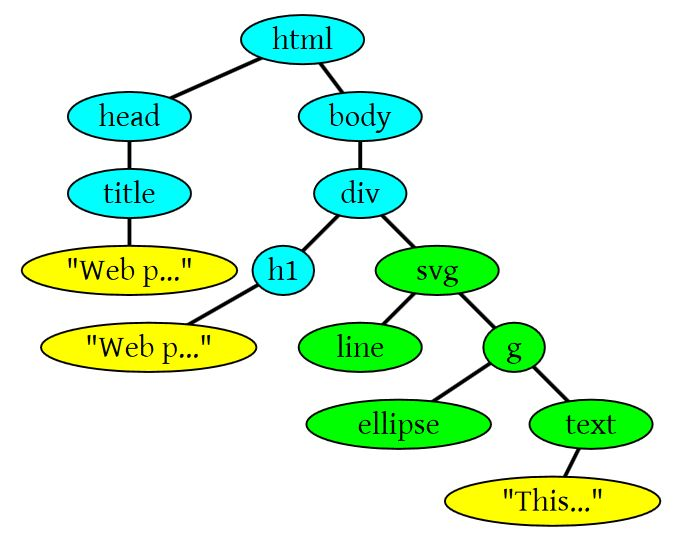

## 1. 浏览器工作流程


<!--more-->

### 上图解析如下：

##### 1) 浏览器会解析三个东西：

- 一个是HTML/SVG/XHTML，事实上，Webkit有三个C++的类对应这三类文档。解析这三种文件会产生一个DOM Tree。
- CSS，解析CSS会产生CSS规则树。
- Javascript，脚本，主要是通过DOM API和CSSOM API来操作DOM Tree和CSS Rule Tree。

##### 2) 解析完成后，浏览器引擎会通过DOM Tree和CSS Rule Tree来构造Rendering Tree。注意：

- Rendering Tree渲染树并不等同于DOM树，因为一些像Header或`display:none;`的东西就没必要放在渲染树中了。
- CSS的Rule Tree主要是为了完成匹配并把CSS Rule附加上Rendering Tree上的每个Element。也就是DOM节点。也就是所谓的Frame。
- 然后，计算每个Frame（也就是每个Element）的位置，这又叫layout和reflow过程。

##### 3) 最后通过调用操作系统Native GUI的API绘制。

## 2. DOM解析

HTML的DOM Tree解析如下：

```
<html>
	<head>
	    <title>Web page parsing</title>
	</head>
	<body>
	    <div>
	        <h1>Web page parsing</h1>
	        <p>This is an example Web page.</p>
	    </div>
	</body>
</html>
```

上面这段HTML会解析成这样：

有SVG标签的情况：

```
<html>
    <head>
        <title>Web page parsing</title>
    </head>
    <body>
        <div>
            <h1>Web page parsing</h1>
            <svg width="300" height="180">
            	<line x1="0" y1="0" x2="200" y2="0" style="stroke:rgb(0,0,0);stroke-width:5" />
            	<g id="myCircle">
              		<ellipse cx="60" cy="60" ry="40" rx="20" stroke="black" stroke-width="5" fill="silver"/>
                	<text x="25" y="20">This is an example Web page.</text>
            	</g>
            </svg>
        </div>
    </body>		
</html>
```



## 3. CSS解析

CSS Parser将CSS解析成Style Rules，Style Rules也叫CSSOM（CSS Object Model）。
StyleRules也是一个树形结构，根据CSS文件整理出来的类似DOM Tree的树形结构：


于HTML Parser相似，CSS Parser作用就是将很多个CSS文件中的样式合并解析出具有树形结构Style Rules。

## 4. 脚本处理

浏览器解析文档，当遇到`<script>`标签的时候，会立即解析脚本，停止解析文档（因为JS可能会改动DOM和CSS，所以继续解析会造成浪费）。
如果脚本是外部的，会等待脚本下载完毕，再继续解析文档。现在可以在script标签上增加属性 `defer`或者`async`。
脚本解析会将脚本中改变DOM和CSS的地方分别解析出来，追加到DOM Tree和Style Rules上。

## 5. 渲染

### 渲染的流程基本上如下（黄色的四个步骤）：

1. 计算CSS样式
2. 构建Render Tree
3. Layout 定位坐标的大小，是否换行，各种position，overflow，z-index属性......
4. 正式开画
   

**注意： 上图流程中有很多连接线，这表示了Javascript动态修改了DOM属性或是CSS属性会导致重新Layout，有些改变不会，就是那些指到天上的箭头，比如，修改后的CSS rule没有被匹配到等**

##### 这里重要说两个概念，一个是Reflow，另一个是Repaint。

- Repaint——屏幕的一部分要重画，比如某个CSS的背景色变了。但是元素的几何尺寸没有变。
- Reflow——意味着元件的几何尺寸变了，我们需要重新验证并计算Render Tree。是Render Tree的一部分或者全部发生了变化。这就是Reflow，或是Layout。（**HTML使用的是flow based layout，也就是流式布局，所以，如果某元件的几何尺寸发生了变化，需要重新布局，也就叫reflow**）reflow会从`<html>`这个root frame开始递归往下，依次计算所有的节点几何尺寸和位置，在reflow过程中，可能会增加一些frame，比如一个文本字符串必须被包装起来。

Relfow的成本比Repaint的成本高得多得多。DOM Tree里的每个节点都会有reflow方法，一个节点的reflow很有可能导致子节点，甚至父节点以及同节点的reflow。**在一些高性能的电脑上也许还没什么，但是如果reflow发生在手机上，那么这个过程是非常痛苦和耗电的。**

所以，以下这些动作有很大可能会是成本比较高的。

- 当你增加、删除、修改DOM节点时，会导致Reflow或Repaint
- 当你移动DOM的位置，或是搞个动画的时候
- 当你修改CSS样式的时候
- 当你Resize窗口的时候，或者滚动的时候
- 当你修改网页的默认字体时

**注： dispaly:none会触发reflow，而visibility:hidden只会触发repaint，因为没有发现位置变化。**

多说两句关于滚屏的事，通常来说，如果在滚屏的时候，我们的页面上的所有的像素都会跟着滚动，那么性能上没什么问题，因为我们的显卡对于这种把全屏像素往上往下移的算法是很快。**但是如果你有一个fixed的背景图，或是有些Element不跟着滚动，有些Elment是动画，那么这个滚动的动作对于浏览器来说会是相当相当痛苦的一个过程。**你可以看到很多这样的网页在滚动的时候性能有多差。因为滚屏也有可能会造成reflow。

基本上来说，reflow有如下的几个原因：

- 初始化（Initial）。网页初始化的时候。
- 渐进（Incremental）。一些Javascript在操作DOM Tree时。
- 改变大小（Resize）。其些元件的尺寸变了（包括外边距、内边框、边框大小、高度和宽度等）。
- 样式改变（StyleChange）。如果CSS的属性发生变化了。
- Dirty。几个Incremental的reflow发生在同一个frame的子树上。

好了，我们来看一个示例：

```
var bstyle = document.body.style; // cache

bstyle.padding = "20px"; // reflow，repaint
bstyle.border = "10px solid red"; // reflow，repaint

bstyle.color = "blue"; // repaint
bstyle.backgroundColor = "#fad"; // repaint

bstyle.fontSize = "2em"; // reflow，repaint

// new DOM element - reflow，repaint
document.body.appendChild(document.createTextNode('dode!'));
```

当然，我们的浏览器是聪明的，它不会像上面那样，你每改一次样式，它就reflow或repaint一次。**一般来说，浏览器会把这样的操作积攒一批，然后做一次reflow，这又叫异步reflow或增量异步reflow。**但是有些情况浏览器是不会这么做的，比如：resize窗口，改变了页面默认的字体等。对于这些操作，浏览器会马上进行reflow。

但是有些时候，我们的脚本会阻止浏览器这么干，比如，如果我们请求下面的一些DOM值：

1. offsetTop, offsetLeft, offsetWidth, offsetHeight
2. scrollTop, scrollLeft, scrollWidth, scrollHeight
3. clientTop, clientLeft, clientWidth, clientHeight
4. IE中的 getComputedStyle(), 或 currentStyle

因为，如果我们的程序需要这些值，那么浏览器需要返回最新的值，而这样一样会flush出去一些样式的改变，从而造成频繁的reflow/repaint。

## 6. 减少reflow(回流)/repaint(重绘)

**1） 不要一条一条地修改DOM的样式。与其这样，还不如预先定义好css的class，DOM的className。**

```
// bad
var left = 10,
top = 10;
el.style.left = left + "px";
el.style.top  = top  + "px";
 
// Good
el.className += " theclassname";
 
// Good
el.style.cssText += "; left: " + left + "px; top: " + top + "px;";
```

**2） 把DOM离线后修改。如：**

- 先把DOM给display:none(有一次reflow)，然后你想怎么改就怎么改。比如修改100次，然后再把他显示出来。

  function appendDataToElement(appendToElement, data) {
    		let li;
    		for (let i = 0; i < data.length; i++) {
    			li = document.createElement('li');
    	        li.textContent = 'text';
    	        appendToElement.appendChild(li);
    	    }
    	}
    	const ul = document.getElementById('list');
    	ul.style.display = 'none';
    	appendDataToElement(ul, data);
    	ul.style.display = 'block';

- 使用文档片段(document fragment)在当前DOM之外构建一个子树，再把它拷贝回文档。

  const ul = document.getElementById('list');
  ​	const fragment = document.createDocumentFragment();
  ​	appendDataToElement(fragment, data);
  ​	ul.appendChild(fragment);

- clone一个DOM结点到内存里，然后想怎么改就怎么改，改完后，和在线的那个的交换一下。

  const ul = document.getElementById('list');
  ​	const clone = ul.cloneNode(true);
  ​	appendDataToElement(clone, data);
  ​	ul.parentNode.replaceChild(clone, ul);

 *浏览器会使用队列来储存多次修改，进行优化，所以对这个优化方案，我们其实不用优先考虑。*

**3） 不要把DOM节点的属性值放在一个循环里当成循环里的变量。**不然这会导致大量地读写这个结点的属性。

```
// bad
function initP() {
	for (let i = 0; i < paragraphs.length; i++) {
		paragraphs[i].style.width = box.offsetWidth + 'px';
	}
}

// good
const width = box.offsetWidth;
function initP() {
	for (let i = 0; i < paragraphs.length; i++) {
		paragraphs[i].style.width = width + 'px';
    }
}
```

**4） 尽可能的修改层级比较低的DOM。**当然，改变层级比较底的DOM有可能会造成大面积的reflow，但是也可能影响范围很小。

**5） 为动画的HTML元件使用fixed或absoult的position，**对于复杂动画效果，由于会经常的引起回流重绘，因此，我们可以使用绝对定位，让它脱离文档流。否则会引起父元素以及后续元素频繁的回流。

**6） 千万不要使用table布局。**因为可能很小的一个小改动会造成整个table的重新布局。

## 7. Virtual DOM

### 什么是Virtual Dom

Virtual Dom可以看做一棵模拟了DOM树的JavaScript树，其主要是通过vnode,实现一个无状态的组件，当组件状态发生更新时，然后触发Virtual Dom数据的变化，然后通过Virtual Dom和真实DOM的比对，再对真实DOM更新。可以简单认为Virtual Dom是真实DOM的缓存。

### 为什么用Virtual Dom

我们知道，当我们希望实现一个具有复杂状态的界面时，如果我们在每个可能发生变化的组件上都绑定事件，绑定字段数据，那么很快由于状态太多，我们需要维护的事件和字段将会越来越多，代码也会越来越复杂，于是，我们想我们可不可以将视图和状态分开来，只要视图发生变化，对应状态也发生变化，然后状态变化，我们再重绘整个视图就好了。

这样的想法虽好，但是代价太高了，于是我们又想，能不能只更新状态发生变化的视图？**于是Virtual Dom应运而生，状态变化先反馈到Virtual Dom上，Virtual Dom在找到最小更新视图，最后批量更新到真实DOM上，从而达到性能的提升。**

除此之外，从移植性上看，Virtual Dom还对真实dom做了一次抽象，这意味着Virtual Dom对应的可以不是浏览器的DOM，而是不同设备的组件，极大的方便了多平台的使用。如果是要实现前后端同构直出方案，使用Virtual Dom的框架实现起来是比较简单的，因为在服务端的Virtual Dom跟浏览器DOM接口并没有绑定关系。

基于 Virtual DOM 的数据更新与UI同步机制:

初始渲染时，首先将数据渲染为 Virtual DOM，然后由 Virtual DOM 生成 DOM。


数据更新时，渲染得到新的 Virtual DOM，与上一次得到的 Virtual DOM 进行 diff，得到所有需要在 DOM 上进行的变更，然后在 patch 过程中应用到 DOM 上实现UI的同步更新。


相关链接：

- [深度剖析：如何实现一个 Virtual DOM 算法](https://github.com/livoras/blog/issues/13)
- [Matt-Esch/Virtual-DOM](https://github.com/Matt-Esch/virtual-dom)
- [Snabbdom](https://github.com/snabbdom/snabbdom)

Virtual DOM主要是实现h(创建Virtual Tree), createElement(创建真实DOM), diff(对比)， patch(更新真实DOM)

```
// 1. 构建虚拟DOM
var tree = h('div.foo#some-id', [
    h('span', 'some text'),
    h('input', { type: 'text', value: 'foo' })
])

// 2. 通过虚拟DOM构建真正的DOM
var root = createElement(tree)
document.body.appendChild(root)

// 3. 更新，生成新的虚拟DOM
var newTree = h('div.foo#some-id', [
    h('span', 'some new text'),
    h('input', { type: 'text', value: 'foo' }),
	h('div', 'new dom')
])

// 4. 比较两棵虚拟DOM树的不同
var patches = diff(tree, newTree)

// 5. 在真正的DOM元素上应用变更
patch(root, patches)
```

Snabbdom主要是实现h(创建虚拟DOM节点)，patch(创建或更新真实DOM)

```
var container = document.getElementById('container');

var vnode = h(
	'div#container.two.classes',
	{on: {click: someFn}},
	[
  	  h(
  	  	'span',
  	  	{style: {fontWeight: 'bold'}},
  	  	'This is bold'
  	  ),
  	  ' and this is just normal text',
      h(
      	'a',
      	{props: {href: '/foo'}},
      	'I\'ll take you places!'
      )
]);
// Patch into empty DOM element – this modifies the DOM as a side effect
patch(container, vnode);

var newVnode = h(
	'div#container.two.classes',
	{on: {click: anotherEventHandler}},
	[
  		h(
  			'span',
  			{style: {fontWeight: 'normal', fontStyle: 'italic'}},
  			'This is now italic type'
  		),
  		' and this is still just normal text',
  		h(
  			'a',
  			{props: {href: '/bar'}},
  			'I\'ll take you places!'
  		)
]);
// Second `patch` invocation
patch(vnode, newVnode); // Snabbdom efficiently updates the old view to the new state
```

性能优化

其实提到 Virtual DOM 的差异比对，有人会对其内部如何处理数组感兴趣。的确，如果数组元素的位置发生了改变，这个要识别起来是有点麻烦。为此，上面两个库，Vue和React 其实都在 Virtual Node 上额外记录了一个**属性“key”**，就是用来辅助进行 Virtual Node 的比对。


*参考资料：*

1. [浏览器的渲染原理简介](https://coolshell.cn/articles/9666.html)
2. [你真的了解回流和重绘吗?](https://mp.weixin.qq.com/s/BboZ5wxNaXXjpAFignOYdw)
3. [一起理解 Virtual DOM](https://www.jianshu.com/p/bef1c1ee5a0e)

